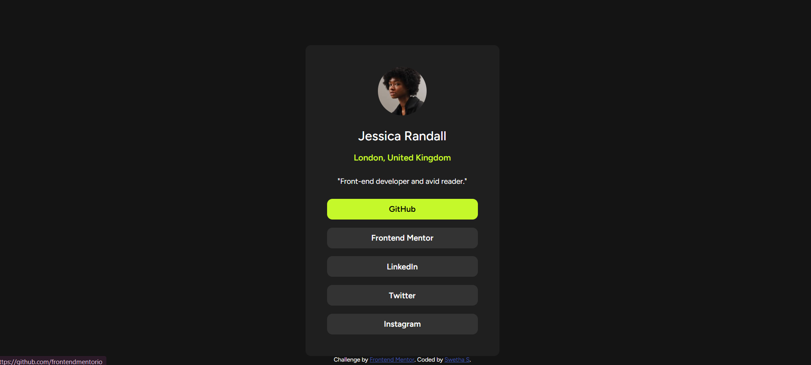

# Frontend Mentor - Blog preview card solution

This is a solution to the [Social links profile challenge on Frontend Mentor](https://www.frontendmentor.io/challenges/social-links-profile-UG32l9m6dQ).

## Table of contents

- [Overview](#overview)
  - [The challenge](#the-challenge)
  - [Screenshot](#screenshot)
  - [Links](#links)
- [My process](#my-process)
  - [Built with](#built-with)
  - [What I learned](#what-i-learned)
  - [Continued development](#continued-development)
  - [Useful resources](#useful-resources)
  - [AI Collaboration](#ai-collaboration)
- [Author](#author)

## Overview

### The challenge

Users should be able to:

- See hover and focus states for all interactive elements on the page

### Screenshot

As the cursor hover on Social Media account, the background-color changes from black to yellow color and font-color changes from white to black.

### Links

- Solution URL: [Add solution URL here](https://github.com/Swetha-Shan/Frontend_mentor3.git)
- Live Site URL: [Add live site URL here](https://swetha-shan.github.io/Frontend_mentor3/)

## My process

### Built with

- Semantic HTML5 markup
- CSS custom properties
- Flexbox

### What I learned

In this session I learned some basics concepts of font,border decoration and hover state and adding social media profile.

### Continued development

Still learning how margin, text-align, padding varies from design to design.

### Useful resources

- [W3Schools](https://www.w3schools.com) - This helped me for Learning basic HTML and CSS. This is good one to start if you are a complete beginner.

### AI Collaboration

## Author

- Frontend Mentor - [@Swetha-Shan](https://www.frontendmentor.io/profile/Swetha-Shan)
